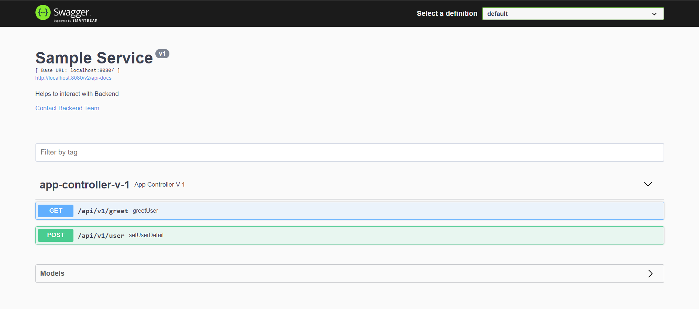
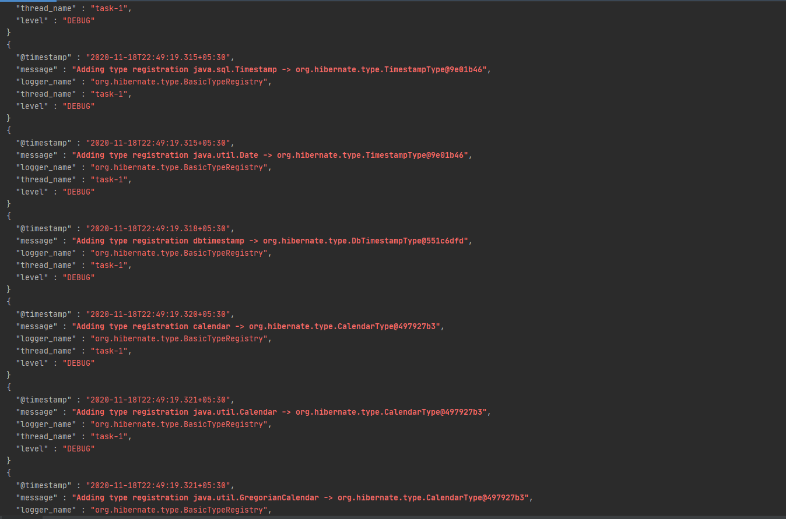

# SPRING BOOT MULTI MODULE PROJECT

> This project is still under development.

This project aims to help the developer to start with spring boot multi-module project quickly. Logging, Exception handling, security are enabled by default.
As of now logging and security module are strictly tied to Microsoft azure. All logs and exceptions are continuously tracked in Microsoft Application Insight.

Anyone can take this skeleton, and can start developing Microservice with Spring Boot in no time, since they majorly need to focus on business logic. This project handles major cross-cutting concerns, and these are available under [lib](https://github.com/nadeem4/spring_boot_multi_module_framework/tree/main/lib) folder. 
> Add your Microservice under **application** folder. I have added one [sample-service](https://github.com/nadeem4/spring_boot_multi_module_framework/tree/main/application/sample-service) under application folder, that can used as a reference.

## LIBRARIES
- *api-docs*
    - [documentation](#api-docs) 
    - [code](https://github.com/nadeem4/spring_boot_multi_module_framework/tree/main/lib/api-docs)
- *file-handler*
    - [documentation](#file-handler)
    - [code](https://github.com/nadeem4/spring_boot_multi_module_framework/tree/main/lib/file-handler)
- *exception*
    - [documentation](#exception)
    - [code](https://github.com/nadeem4/spring_boot_multi_module_framework/tree/main/lib/exception)
- *logging*
    - [documentation](#logging)
    - [code](https://github.com/nadeem4/spring_boot_multi_module_framework/tree/main/lib/logging)
- *security*
    - [documentation]((#security))
    - [code](https://github.com/nadeem4/spring_boot_multi_module_framework/tree/main/lib/security)
- *utility*
    - [documentation](#utility)
    - [code](https://github.com/nadeem4/spring_boot_multi_module_framework/tree/main/lib/utility)


## How to bootstrap new Microservice

## api-docs
Add below dependency to pom.xml
```xml
 <dependency>
    <groupId>com.app</groupId>
    <artifactId>api-docs</artifactId>
    <version>${project.version}</version>
  </dependency>
```

Add below content to application.yml file, to modify the default value swagger variables

```yaml
app:
  swagger:
    enable-auth: true
    title: Sample Service API
    desc: Helps to interact with Backend
    version: v1
    path-mapping: /
    oauth:
      client-id: '${backend-client-id}'
      client-key: '${backend-client}'
      resource: '${backend-resource}'
      login-endpoint: '${auth-url}'
    contact:
      name: Backend Team
      email: test@test.com
      url: ''
    license: null
    license-uri: null

```

Enable swagger by only adding **@EnableDocs** annotation on Main Class.

```JAVA
package sample_service;

import apidocs.annotations.EnableDocs;
import org.springframework.boot.SpringApplication;
import org.springframework.boot.autoconfigure.SpringBootApplication;

@SpringBootApplication
@EnableDocs
public class Application {
    public static void main( String[] args ) { SpringApplication.run(Application.class, args);}
}

```




## file-handler
Exceptions will be automatically handled by Exception Module

Add below dependency to pom.xml

```xml
<dependency>
     <groupId>com.app</groupId>
     <artifactId>file-handler</artifactId>
     <version>${project.version}</version>
 </dependency>
```

Add below content in application.yml file

```yaml
azure:
  storage:
    account-name: ${blob-name} 
    account-key: ${blob-key}
    container-name: ${container-name}
```

> Import FileUtil from **file_handler.util**

It has 3 functionality:

- Upload Blob

```JAVA
package file_handler;

import file_handler.util.FileUtil;

public class FileHandler {
  @Autowired
  private FileUtil fileUtil;
  public URI uploadBlob(MultipartFile file, String blobName) {
        return fileUtil.uploadFile(file, blobName);
  }
}
```
- Delete Blob

```JAVA
package file_handler;

import file_handler.util.FileUtil;

public class FileHandler {
  @Autowired
  private FileUtil fileUtil;

  public void delete(String url, String blobName) {
      fileUtil.deleteBlob(url, blobName);
  }
}

```
- Download Blob

```JAVA
package file_handler;

import file_handler.util.FileUtil;

public class FileHandler {
   @Autowired
   private FileUtil fileUtil;

    public ResponseEntity<Resource> download(String url, String blobName) {
        return fileUtil.downloadBlob(url, blobName);
    }
}
   
```

## exception

> It is already a part of backend starter

```xml
 <dependency>
    <groupId>com.app</groupId>
    <artifactId>backend-starter</artifactId>
    <version>${project.version}</version>
  </dependency>
```

> If you are not adding backend starter, then it can be added individually as well

```xml
 <dependency>
    <groupId>com.app</groupId>
    <artifactId>exception</artifactId>
    <version>${project.version}</version>
  </dependency>
```

Below are the exception that are handled by this module:

__*System Exception*__

- ArrayIndexOutOfBoundsException
- IndexOutOfBoundsException
- NumberFormatException
- IllegalArgumentException
- AccessDeniedException
- NullPointerException
- MethodArgumentTypeMismatchException
- DataAccessException
- SQLServerException
- ConstraintViolationException
- HttpRequestMethodNotSupportedException
- HttpMediaTypeNotSupportedException
- MissingPathVariableException
- HttpMessageNotReadableException
- HttpMessageNotWritableException
- MissingServletRequestParameterException
- ConversionNotSupportedException
- TypeMismatchException
- MethodArgumentNotValidException
- MissingServletRequestPartException
- NoHandlerFoundException

__*Custom Exception*__

- InvalidStateTransitionException
- DuplicateRecordException
- EntityNotFoundException
- MultipleActionFailedException
- OperationNotAllowedException
- OperationFailedException
- FileHandlingException


## logging

> It is already a part of backend starter

```xml
 <dependency>
    <groupId>com.app</groupId>
    <artifactId>backend-starter</artifactId>
    <version>${project.version}</version>
  </dependency>
```

> If you are not adding backend starter, then it can be added individually as well

```xml
 <dependency>
    <groupId>com.app</groupId>
    <artifactId>logging</artifactId>
    <version>${project.version}</version>
  </dependency>
```

Out of the box logging for Repository, Service, Controller and Components, once below dependency added to pom.xml, and for all other functions of classes use **@Loggable** annotation.

```JAVA
package sample_service.dto.mapper;

import logging.annotations.Loggable;
import sample_service.dto.model.AppModelDTO;
import sample_service.model.AppModel;

public class AppModelMapper {

    @Loggable
    public AppModel convertToModel(AppModelDTO modelDTO) {
        AppModel model = new AppModel();
        model.setId(modelDTO.getId());
        model.setName(modelDTO.getName());
        return model;
    }
}

```

**@Loggable** has 4 optional parameters, that can set, if want to log some different messages.

```JAVA
package sample_service.dto.mapper;

import logging.annotations.Loggable;
import sample_service.dto.model.AppModelDTO;
import sample_service.model.AppModel;

public class AppModelMapper {

    @Loggable(valueAfter = "Value After", valueAfterReturning = "Value After Returning", valueAround = "Value Around", valueBefore = "Value Before")
    public AppModel convertToModel(AppModelDTO modelDTO) {
        AppModel model = new AppModel();
        model.setId(modelDTO.getId());
        model.setName(modelDTO.getName());
        return model;
    }
}

```

It will be capturing following properties:
- __class_name__: Name of the class to which functions belong.
- __method_name__: Name of the method which is getting executed.
- __parameters__: Parameters of function.
- __execution_time_in_ms__: Time take by a function.
- __microservice__: Name of the microservice.
- __request_id__: Unique Id with every request, that will also help to trace logs in Application Insight, if used.
- __version__:  Microservice version.
- __message__:  
   - When function is starting: **FUNCTIONNAME function started.**.
   - When function complete: **FUNCTIONNAME function completed.**. 
   - In case of error it will contain error message.
   - When Controller starts: **FUNCTIONNAME event started.**.
   - When Controller completes: **FUNCTIONNAME event completed.**.

In order to send logs to Application Insight, add below content to application.yml

```yaml
azure:
  application-insights:
    instrumentation-key: ${appinsight-instrumentation-key}
    enabled: true
```



## security

*__As of now it only supports v1 token.__*

> It is already a part of backend starter

```xml
 <dependency>
    <groupId>com.app</groupId>
    <artifactId>backend-starter</artifactId>
    <version>${project.version}</version>
  </dependency>
```

> If you are not adding backend starter, then it can be added individually as well

```xml
 <dependency>
    <groupId>com.app</groupId>
    <artifactId>security</artifactId>
    <version>${project.version}</version>
  </dependency>
```

Enable security by only adding **@EnableSecurity** annotation on Main Class.

Add below content to application.yaml, if you are enabling security module

```yaml
spring:
  security.oauth2.client.registration.azure:
    client-id: '${client-id-dev}'
    client-secret: '${client-secret-dev}'
    client-name: Azure
azure:
  activedirectory:
    client-id: '${client-id-dev}'
    allow-telemetry: true
    client-secret: '${client-secret-dev}'
    user-group.allowed-groups: TEST_AZURE_AD_GROUP
    tenant-id: '${tenant-id-dev}'

```

> If you want to disable out of box spring security, then add below content in application.yaml
```yaml
spring:
  autoconfigure:
    exclude:
      - org.springframework.boot.autoconfigure.security.servlet.SecurityAutoConfiguration
      - org.springframework.boot.actuate.autoconfigure.security.servlet.ManagementWebSecurityAutoConfiguration
```
```JAVA
package sample_service;

import apidocs.annotations.EnableDocs;
import org.springframework.boot.SpringApplication;
import org.springframework.boot.autoconfigure.SpringBootApplication;
import security.annotations.EnableSecurity;

@SpringBootApplication
@EnableDocs
@EnableSecurity
public class Application {
    public static void main( String[] args ) { SpringApplication.run(Application.class, args);}
}

```
## utility

Add below dependency to pom.xml, in order to add utility module
```xml
 <dependency>
    <groupId>com.app</groupId>
    <artifactId>utility</artifactId>
    <version>${project.version}</version>
  </dependency>
```

It has few important component:

- __ValidList:__ Use this when you are adding any validators to an element of List.
```JAVA
package sample_service.controller.v1.api;

import utility.annotations.ControllerV1;

@ControllerV1
public class AppController {

  @PostMapping(path = "/user")
    public ResponseEntity<ResponseDTO> setUsersDetail(@Valid @RequestBody ValidList<AppRequest> request) {
    
        return new ResponseEntity( ResponseDTO.setResponseDTO(
                Messages.setMessage(EntityType.USER, ActionType.CREATED, "")),
                HttpStatus.CREATED
        );
    }}
```
- __ResponseDTO:__ Use this DTO, for returning response to Users, for POST, PUT, PATCH, DELETE actions. It has a static  method  **setResponseDTO** that can be used, to set the message in response, other fields will be set by default.
    - status: HttpStatus (This will be set to CREATED by default)
    - message: String ( Use **setResponseDTO** method to set this value, this a static method. **ResponseDTO.setResponseDTO( Messages.setMessage(EntityType.USER, ActionType.CREATED, ""))**).                                                                                                      
    - timestamp: Date (This will set to current timestamp by default. It uses __"dd-MM-yyyy hh:mm:ss Z"__ format).
    - requestId: String ( This will be set by default to unique value for every request. e.g. **123e4567-e89b-12d3-a456-556642440000**
)
    - detailMessage: List

```JAVA
package sample_service.controller.v1.api;

import utility.annotations.ControllerV1;

@ControllerV1
public class AppController {

  @PostMapping(path = "/user")
    public ResponseEntity<ResponseDTO> setUsersDetail(@Valid @RequestBody ValidList<AppRequest> request) {
    
        return new ResponseEntity( ResponseDTO.setResponseDTO(
                Messages.setMessage(EntityType.USER, ActionType.CREATED, "")),
                HttpStatus.CREATED
        );
    }}
```


